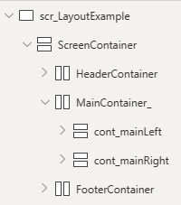
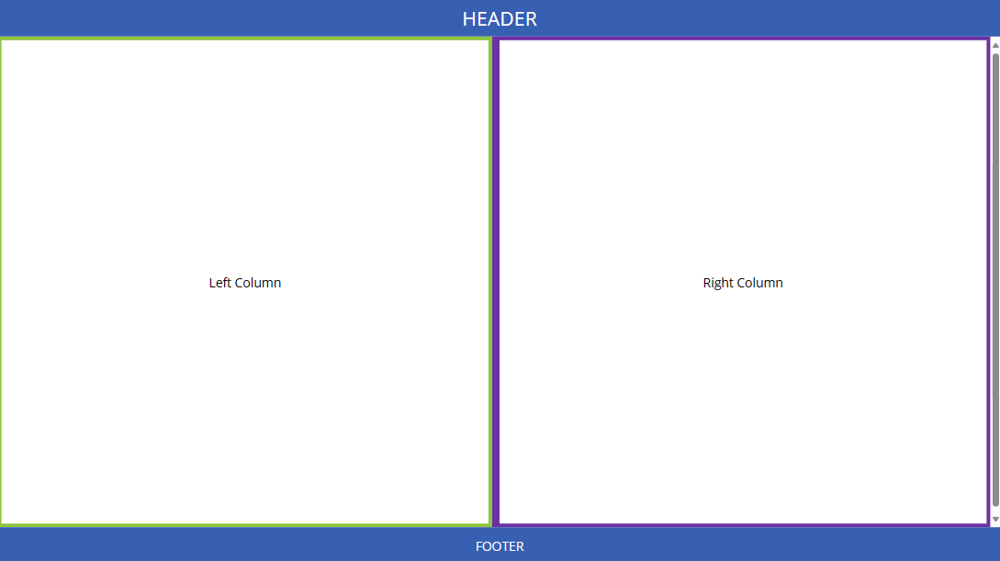
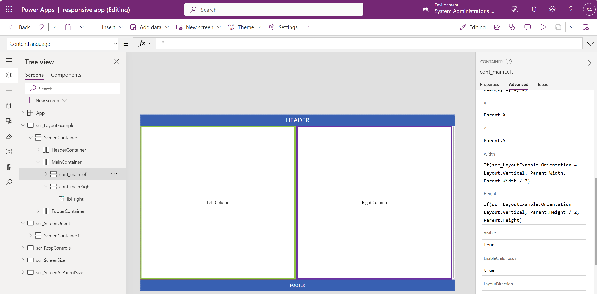

# Developing Responsive Canvas Apps
Canvas apps are not automatically responsive to device or client size. However, there are capabilities available in Canvas apps (and Custom Pages in Dataverse) for responsive design. 

The purpose of this page and the provided sample shows the more manual and flexible approach to responsive design - for example, dynamically changing horizontal layouts to vertical layouts (or wrapping columns underneath for smaller widths).

As a learning tool, find the **ResponsiveCanvasSample_XXXX.zip** sample canvas app export package in the [Samples](./Samples/) folder of this repo. This package can be imported into a sandbox or developer power apps environment to see a sample implementation of the concepts in this page.

# Foundational Information
You can use auto-layout containers and responsive templates to stand up basic responsive apps quickly. See Power Apps documentation to learn the basics. 
* [Getting Started with Building Responsive Apps](https://learn.microsoft.com/en-us/power-apps/maker/canvas-apps/build-responsive-apps)
* [Follow along example for auto-layout container](https://learn.microsoft.com/en-us/power-apps/maker/canvas-apps/build-responsive-apps#example-for-auto-layout-container)
* [Disable Scale to Fit to respect responsive design](https://learn.microsoft.com/en-us/power-apps/maker/canvas-apps/create-responsive-layout#disable-scale-to-fit)

# Advanced Concepts for Dynamic Layouts
For more complex canvas screens that need to fit a wide range of screen sizes, use of the auto-layout containers may not be sufficient. For instance if a screen is developed for a table size and contains two columns of controls, but needs to also support a mobile layout, the right column may need to wrap under the left column when loaded on a phone. There are a few key formulas to understand to make this possible. 

**Read the Reference Documentation:** [Create responsive layouts in canvas apps](https://learn.microsoft.com/en-us/power-apps/maker/canvas-apps/create-responsive-layout)

## Actual vs. Design Height and Width Properties
When you choose the Screen Size and Orientation in the Display Settings of the app (Tablet or Phone, and Landscape or Portrait), you are setting the **App.DesignWidth** and **App.DesignHeight** properties, which can be referenced in formulas. 

In contrast the **App.Height** and **App.Width** represent the actual current height and width of the app based on the device or browser size it is opened in. 

## Use Nested Auto-Layout Containers
Design your screens with dynamic layouts in mind by breaking it into nested containers to create the layout, so that each container can be sized relative to its parent and and/or adjacent controls. For example, a two column app with a header and a footer might be designed with the following container layout:

 

Always use the **Horizontalcontainer** and **Vertical container** layout components, as they auto-layout components placed inside them for easier responsive design. The basic **Container** component does not have auto-layout capabilities. 

## Use Parent.Height and Parent.Width and Relative Formulas
For full responsive design, all controls and containers should have their height and width set to be dynamic and relative to their parent and/or siblings. The only acception to this, is where auto-layout containers manage this for you. 

In the example above, _cont_mainLeft_ and _cont_mainRight_ will automatically have equal widths set by their parent _MainContainer_ since it is a Horizontal (auto-layout) Container. This can be overridden with formulas if desired. For instance, _HeaderContainer_ and _FooterContainer_ may have fixed heights and _MainContainer_ will then have a formula to use the remainder of the parent container's height.

| Container  | Height Formula   | Width Formula   | X | Y | Note |
|-------------- | -------------- | -------------- | --------- |--------- | --------- |
| _ScreenContainer_ | `Parent.Height` | `Parent.Width` | `0` | `0` | fit to full size of app as loaded |
| _HeaderContainer_ | `50` | `Parent.Width` | Managed by _ScreenContainer_ auto layout | Managed by _ScreenContainer_ auto layout | fit to width of _ScreenContainer_, with a static height |
| _FooterContainer_ | `50` | `Parent.Width` | Managed by _ScreenContainer_ auto layout| Managed by _ScreenContainer_ auto layout | fit to width of _ScreenContainer_, with a static height |
| _MainContainer_ | `Parent.Height - HeaderContainer.Height - FooterContainer.Height` | `Parent.Width` | Managed by _ScreenContainer_ auto layout | Managed by _ScreenContainer_ auto layout | fit to width of _ScreenContainer_, fit to height of _ScreenContainer_ remaining after subtracting header and footer heights|
| _cont_mainLeft_ | `Parent.Height` | `Parent.Width / 2` | Managed by _MainContainer_ auto layout | Managed by _MainContainer_ auto layout | fit to exactly half of the _MainContainer_ width, while fitting to the full height of of the _MainContainer_ |
| _cont_mainRight_ | `Parent.Height` | `Parent.Width / 2` | Managed by _MainContainer_ auto layout | Managed by _MainContainer_ auto layout | fit to exactly half the _MainContainer_ width, while fitting to the full height of the _MainContainer_|

> **A note on using relative formulas**   
> When using relative formulas, such as the example below, be sure to use all relative references to ensure true fit and proper responsiveness.  
> `Parent.Height - HeaderContainer.Height - FooterContainer.Height`   
> Adding a discrete value such as 50 into that formula can throw the "fit" math off causing the object to not fit responsively. To create whitespace or gaps between containers or components, use properties of parent containers, such as _LayoutGap_ or _PaddingTop_ rather than adding discrete values into height and width formulas. You can reference these properties in height and width formulas as necessary as well. 

## Dynamically Adjust Layout - Column Wrap
The above example works fine for many devices sizes with at least a minimum width that can fit two columns. But if you are designing for a tablet and also need to fit to a phone form factor, you may need to "wrap" the right column under the left column on narrow (or portrait) devices. To do this, you can use `If` statements within the height, width, x and y formulas to dynamically split into two columns (for wider displays) or two rows (for narrower displays).

For reference, refer to documentation for foundational concepts:
* [Use formulas for dynamic layout](https://learn.microsoft.com/en-us/power-apps/maker/canvas-apps/create-responsive-layout#use-formulas-for-dynamic-layout)

Width Example Formula:  
`If(scr_LayoutExample.Orientation = Layout.Vertical, Parent.Width, Parent.Width / 2)`

Height Example Formula:  
`If(scr_LayoutExample.Orientation = Layout.Vertical, Parent.Height / 2, Parent.Height)`

